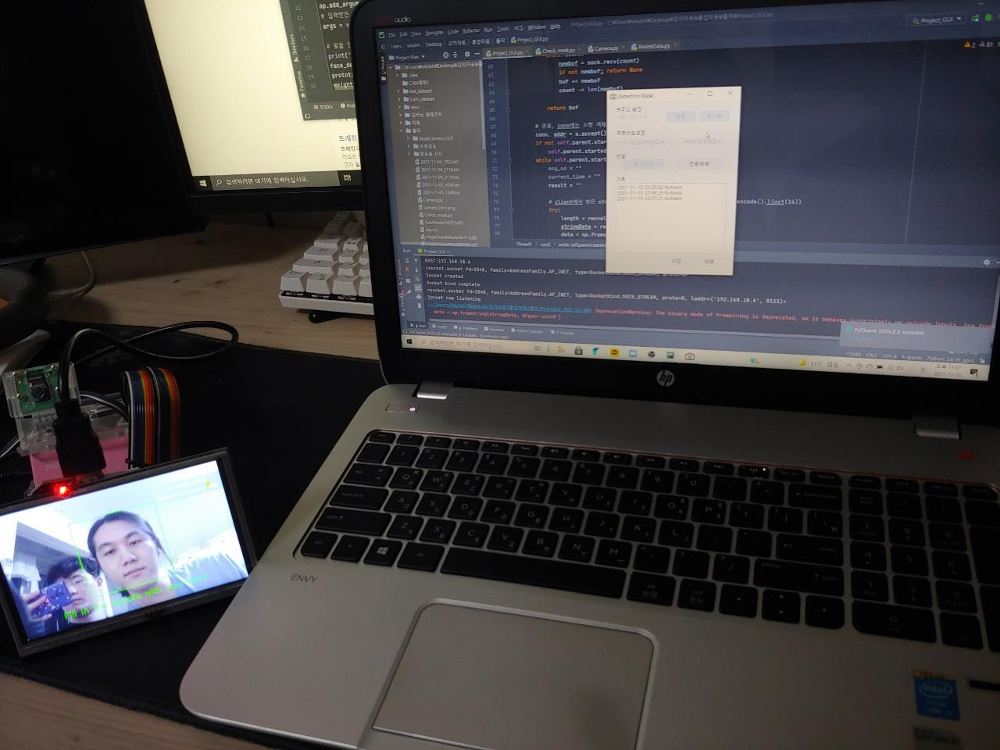
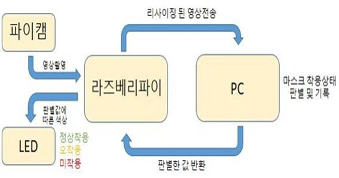
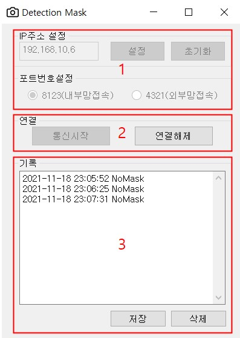
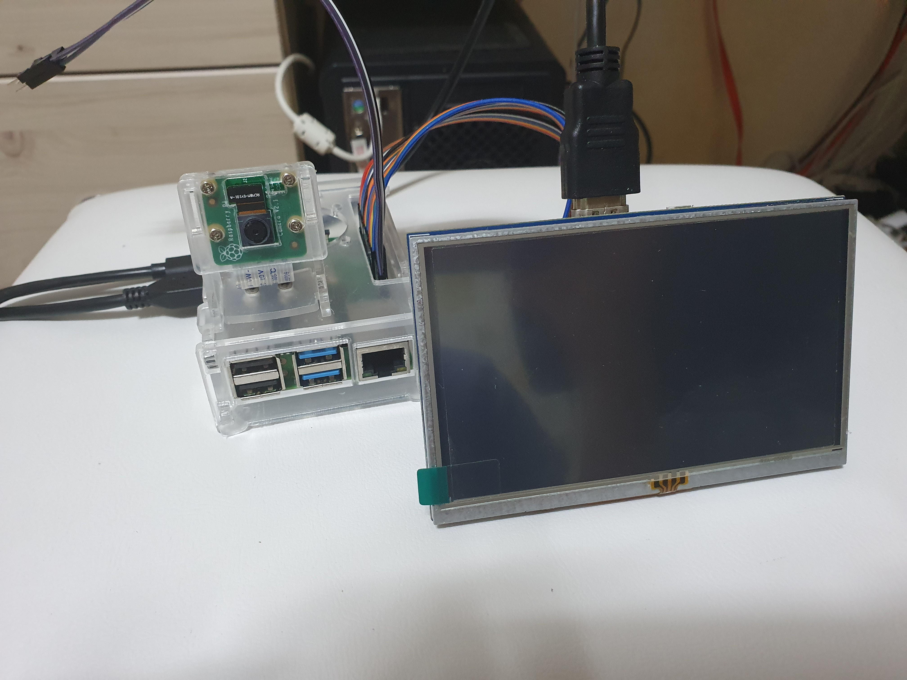
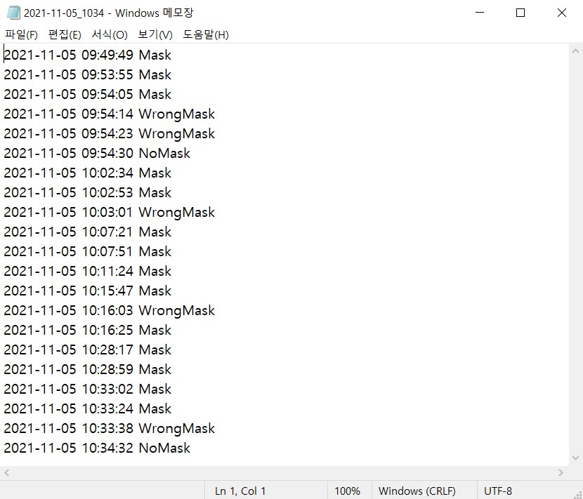
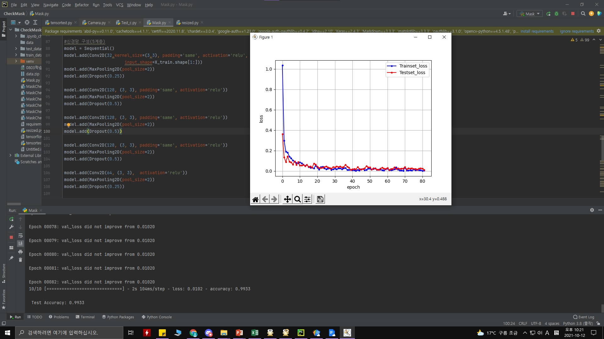
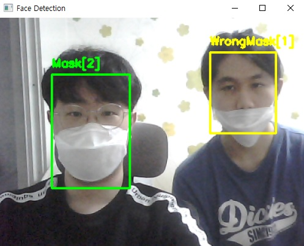

# 팬데믹 상황속 전염병 확산방지 마스크 미, 오착용 감지카메라

## 시연영상
[유튜브영상](https://youtu.be/6WgJ_igQmO0)   

## 개발 배경 및 필요성
세계적인 팬더믹 상황으로 인해, 전염병 확산 방지를 위한 마스크 착용이 필수가 되어버렸다. 하지만 방역 수칙을 제대로 지키지 않는 사람들도 꾸준히 보고되어왔으며, 이에 대한 뉴스를 인터넷, TV같은 매체에서 쉽게 접할 수 있고, 사회적인 문제가 되고 있다. 따라서 거의 대부분의 장소에선 마스크 착용 유무를 감시하기 위해 인적자원이 투자되고 있다. 이에 대해 인적 자원이 사용되는 것을 최소화하고자, 마스크 미, 오착용 과정을 자동화 하는 프로그램을 만들어 보고자 이 주제를 선정하게 되었다. 
연구의 필요성은 배경에서 언급하였듯, 마스크 착용 유무를 확인한다는 단순한 작업을 위해 인적자원이 투입되고 있다. 또한 마스크 착용을 부탁하는 응대로 인해 마스크를 착용하지 않은 사람들과 마찰이 빚어질 수 있고, 이 과정에서 생긴 마찰은 사회적 문제가 되고 있다. 
따라서 이 단순 작업을 자동화 할 수 있다면, 인적 자원을 좀 더 효율적인 작업에 투자하는 것으로 비용 손실을 최소화 하거나 업무 효율을 증가시킬 수도 있다. 또, 입구 같은 곳에 설치함으로써, 마스크 미 착용 문제로 말다툼이나 마찰이 일어나는 것을 원천적으로 방지할 수 있다. 이로 인해 감정 노동자들의 정신적인 스트레스를 방지할 수 있을 것이다.

## 개발목표
구상한 프로그램은 다음과 같다. 마스크 미, 오착용 감지 카메라 프로그램을 실행하면 라즈베리파이에 연결된 카메라를 통해 촬영하고, 촬영된 영상에서 사람의 얼굴이 판별될 경우 해당하는 순간을 이미지로 서버에 전송한다. 그리고 서버 측에서 받은 이미지를 학습된 모델에 넣어 마스크 착용유무를 판단하여 라즈베리파이로 결과 값을 돌려준다. 
서버 측에서는 관리자가 쉽게 프로그램을 관리 할 수 있도록 GUI(Graphical User Interface)를 함께 개발하여 여러 컴퓨터에서 쉽게 사용할 수 있는 환경을 구성한다. GUI에는 통신을 위한 IP주소의 입력과 포트번호 설정, 마스크 착용의 판별 기록, 그리고 이 기록을 별도의 파일로 저장할 수 있는 기능을 제공한다. 기록은 txt파일로 저장되며, 저장되는 내용에는 판별한 결과값과 함께 해당 시간이 기록된다.

상술된 기능들을 수행하기 위해서 2가지의 학습모델을 개발한다.
1) 라즈베리파이에서 동작할 사람얼굴 인식 모델
2) 마스크 착용유무 판별 모델

## 전체 시스템 블록 다이어그램

## 동작원리
상술된 기능들을 수행하기 위해 학습 모델을 제작할 필요가 있었다. 라즈베리파이에서 사람의 얼굴을 인식하기 위한 용도와 마스크의 착용 상태를 판별하기 위한 용도의 두 가지 학습 모델을 제작하였다. 해당 학습 모델들을 제작하기 위해 마스크 착용, 미착용, 오착용의 사진 각각 1,000장. 합 3000장 정도의 이미지 데이터를 준비하였다. 
첫 번째는 라즈베리파이에서 동작할 사람 얼굴 인식 모델이다. Python Tensorflow 라이브러리의 Keras를 사용하며, 사용한 학습 방법은 이미지 학습에 적합한 CNN(Convolution Neural Network)방식을 사용하였다. 이 모델은 사람 얼굴과 사람 얼굴이 아닌 것 2가지를 분류하는 ‘이진분류’ 방식을 사용한다. 
두 번째는 마스크 착용 유무 판별 모델로 마찬가지로 Python Tensorflow 라이브러리의 Keras를 이용하여 CNN방식으로 학습시켰다. 이 모델은 마스크 착용, 미착용, 오착용. 총 3가지를 분류하는 방식으로 모델을 완성시켰고, 이 모든 과정은 Pycharm 개발 툴을 사용하였다. 
위에서 간략한 연구 동작 과정을 설명하였다. 실제 환경에선 GUI를 이용하여 프로그램을 사용하게 되는데, 현재 컴퓨터의 IP주소를 입력하고 라즈베리파이와 같은 네트워크에 있는지, 아니면 다른 네트워크에 있는지에 따라 포트번호를 정하고 통신 시작 버튼을 누르면 소켓 통신이 시작된다. 통신이 시작된 이후, 라즈베리파이 측에서 사람의 얼굴이 인식되었을 때 서버로 이미지를 보내 마스크 착용 유무를 판단하고 기록 창에 시간과 판별 기록을 표시하고 관리자가 기록을 따로 저장 할 수 있게 기능이 구현되어 있다.

GUI의 기능에 대한 설명은 첨부한 이미지처럼 크게 3가지 부분으로 나눌 수 있다. 

1) 첫 번째 프레임은 전반적인 통신 환경을 설정하는 부분이다. 서버측(PC)의 IP 주소를 입력하고 설정 버튼을 눌러 IP 주소를 받아올 수 있다. 해당 과정은 초기화 버튼을 누르는 것으로 다시 진행 할 수도 있다. 그리고 소켓 통신의 포트 번호를 지정해주는 것으로 통신 준비를 해준다.
2) 두 번째 프레임에서는 통신을 제어하는 부분이다. ‘통신시작’버튼을 누르는 것으로 1)에서 설정한 환경에 따라 통신을 시작하도록 명령할 수 있으며, ‘연결해제’ 버튼을 누르는 것으로 라즈베리파이와의 통신을 종료하는 것이 가능하다.
3) 세 번째 프레임은 라즈베리파이 측에서 보내온 이미지를 판별한 결과값을 저장한 로그를 보여준다. 해당 로그는 저장 버튼을 누르는 것으로 txt 파일 형식으로 저장할 수 있으며, 삭제 버튼으로 초기화 시켜줄 수 있다.

## 개발 팀
### 최지훈
- 학습모델 제작 및 최적화작업
- GUI 제작
- 서버측 기능구현(이미지를 받아 마스크 착용상태를 판별하고 기록)

### 이승표
- 학습데이터 수집
- 라즈베리파이 영상처리 코딩
- 소켓통신 시스템 구축

## 개발 결과

 
<결과물 외형 사진>

 
<판별기록을 파일로 저장한 모습>

 
<학습 모델 성능분석>

 
<학습 모델 테스트>

## 아쉬운 점
제작을 하면서 가장 난관에 빠졌던 것은 라즈베리파이의 성능 문제였다. 처음엔 오픈 소스로 개방된 ResNet기반의 사람 얼굴 트래킹(Tracking)의 모델을 사용해서 얼굴 부분의 프레임을 생성 한 뒤 그 부분만을 잘라내어 마스크 판별에 사용하고자 하였으나, PC환경에서 테스트 했을 땐 문제없이 돌아가던 모델이 라즈베리 환경에서 동작 시켰을 때, 실사용이 불가능할 정도의 프레임이 나왔다. 트래킹을 하는 부분에서 라즈베리파이의 성능이 연산을 따라가지 못한다고 판단하여, 라즈베리파이 디스플레이에 사각형 프레임을 만들어 이 안에 얼굴이 인식 되었을 때 서버로 이미지를 전송하는 방식으로 시스템을 변경하였다. 이 부분에서도 학습이 무거워 질수록 라즈베리파이에서 프레임이 낮게 나와 최대한 가볍게 학습모델을 만들 도록 층계와 batch size, 필터 수를 조정하였으나, 약간의 프레임드랍은 여전히 존재했다.
